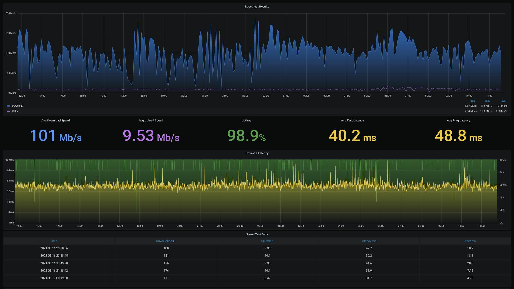

# Docker Speedtest #  

This repo implements a basic [Ookla speedtest](https://www.speedtest.net) container, an [influxdb](https://www.influxdata.com) container to store the data, and a [Grafana](https://grafana.com) container to visualize the data.  
  
I'm currently using this at home on a [Raspberry Pi](https://www.raspberrypi.org/products/raspberry-pi-4-model-b) to benchmark my [StarLink](https://www.starlink.com) internet service.  
  
  

  
  
## Setup ##  
  
This setup assumes you have [Docker](https://docker.com) installed on a Debian or Ubuntu system. The steps here should be portable to other OS's but are beyond the scope of this repo.  
  
I also use the ip ```192.168.80.86``` throughout, substitute your own ip.  
  

### Influxdb ###  
  
We need a place to store the speedtest data, so the first container we create is Influxdb. First we start by making a place for the container to store it's persistent data.

```
mkdir /path/to/docker-data/influxdb
```
  
Next, we launch the container using the same path we just created:  
  
```
docker run -d \
  --name influxdb \
  --restart always \
  -p 192.168.80.86:8086:8086 \
  --volume /path/to/docker-data/influxdb:/var/lib/influxdb \
  influxdb:1.8.5
```
  
Influxdb should now be running in a container. However, we next need to create a database to store our data. To do this, I use the influxdb-client command line tool to connect to the db server and create a database.  

Install the client:  
  
```
sudo apt install influxdb-client
```
  
Connect to the influxdb server:  
  
```
influx -host 192.168.80.86
```
  
Create the database:  
  
```
create database speedtests
```
  
Verify the new database is present:  
  
```
show databases
```
  
Disconnect from the server:  
  
```
exit
```
  
You should now have a database called ```speedtests``` ready for data.  
  

### Ookla Speedtest ###  
  
I use the Dockerfile from [Breadlysm](https://github.com/breadlysm/speedtest-to-influxdb) to build my own Ookla image/container. Please refer to that site for further customizations.  
  
You may adjust the speedtest interval (in minutes) by changing ```SPEEDTEST_INTERVAL```. With an interval of 30 minutes, it will download about 4 gigabytes of data per day in speedtests. The ```PING_INTERVAL``` is in seconds.  
  
Build the image using the Dockerfile in this repo.   
  
```
sudo docker build -t mydockerusername/ookla:1 .
```
  
Next we run a container with the image we just built.  
  
I use the Chicago Ookla speedtest server, ```SPEEDTEST_SERVER_ID``` with a value of ```5900```. You may use a different server from [this list](https://c.speedtest.net/speedtest-servers-static.php). 
  
```
docker run -d \
 -t \
 --name ookla \
 -e 'NAMESPACE'='None' \
 -e 'INFLUX_DB_ADDRESS'='192.168.80.86' \
 -e 'INFLUX_DB_PORT'='8086' \
 -e 'INFLUX_DB_USER'='' \
 -e 'INFLUX_DB_PASSWORD'='' \
 -e 'INFLUX_DB_DATABASE'='speedtests' \
 -e 'SPEEDTEST_INTERVAL'='30' \
 -e 'SPEEDTEST_FAIL_INTERVAL'='5'  \
 -e 'SPEEDTEST_SERVER_ID'='5900' \
 -e 'PING_INTERVAL'='10' \
 -e 'PING_TARGETS'='8.8.8.8,8.8.4.4' \
 mydockerusername/ookla:1
 ```
   
Your Ookla speedtest container should now be running and populating influxdb with data.  
  
  
### Grafana ###  
  
Now we launch a Grafana container to visualize the data.  
  
    
```
docker run -d \
  --name=grafana \
  -p 3000:3000 \
  grafana/grafana
```
  
Now that our Grafana container is running, we navigate to the webserver at [http://192.168.80.86:3000](http://192.168.80.86:3000) and login with ```admin/admin```.  
  
To connect Grafana to our influxdb, we navigate to the Grafana configuration settings and go to Data Sources. Click add data source, search for ```influx``` and select.  
  
You may name the connection anything you would like, the important setting is URL and I use [http://192.168.80.86:8086](http://192.168.80.86:8086) which is where the InfluxDB container is running. Click ```Save & Test```.  
  
For the last step, we will import a dashboard into Grafana. In Grafana, click + then import. Copy to your clipboard the data from the [Grafana-SpeedTest-dashboard.json](Grafana-SpeedTest-dashboard.json) file in this repo and paste it in and click Load.  
  
# Congratulations! #

You can now sit back and enjoy your speedtest visualizations!

-Greg ✌️🙂 